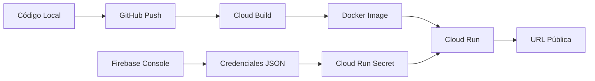

# Resumen Ejecutivo: Deployment en Google Cloud Run

## ✅ Lo que se Preparó

1. ✅ **Dockerfile** optimizado para Cloud Run
2. ✅ **requirements.txt** actualizado
3. ✅ **main.py** modificado para Cloud Run (puerto dinámico, host 0.0.0.0)
4. ✅ **firebase_config.py** actualizado para leer credentials desde environment
5. ✅ **.dockerignore** para optimizar build
6. ✅ **Guías completas** de deployment

---

## 📁 Archivos Creados/Modificados

### Nuevos Archivos

1. **[Dockerfile](file:///home/raulsalazar/CascadeProjects/nutri-agenda-flet/Dockerfile)**
   - Imagen base: Python 3.12-slim
   - Puerto: 8080 (estándar Cloud Run)
   - Optimizado para tamaño reducido

2. **[.dockerignore](file:///home/raulsalazar/CascadeProjects/nutri-agenda-flet/.dockerignore)**
   - Excluye archivos innecesarios del build
   - Reduce tamaño de imagen Docker

3. **[CLOUD_RUN_DEPLOYMENT.md](file:///home/raulsalazar/CascadeProjects/nutri-agenda-flet/CLOUD_RUN_DEPLOYMENT.md)**
   - Guía paso a paso completa
   - 5 pasos: Firebase → GitHub → Cloud Run → Dominio → Troubleshooting

4. **[FIREBASE_CREDENTIALS.md](file:///home/raulsalazar/CascadeProjects/nutri-agenda-flet/FIREBASE_CREDENTIALS.md)**
   - Cómo obtener archivo JSON de credenciales
   - Guía visual paso a paso

5. **[GITHUB_SETUP.md](file:///home/raulsalazar/CascadeProjects/nutri-agenda-flet/GITHUB_SETUP.md)**
   - Cómo subir código a GitHub
   - Opciones: Terminal y GitHub Desktop

### Archivos Modificados

1. **[main.py](file:///home/raulsalazar/CascadeProjects/nutri-agenda-flet/main.py)**
   - Ahora usa puerto dinámico desde environment variable `PORT`
   - Host cambiado a `0.0.0.0` (necesario para Cloud Run)

2. **[requirements.txt](file:///home/raulsalazar/CascadeProjects/nutri-agenda-flet/requirements.txt)**
   - Simplificado y limpio
   - Versiones específicas para producción

3. **[services/firebase_config.py](file:///home/raulsalazar/CascadeProjects/nutri-agenda-flet/services/firebase_config.py)**
   - Soporte para leer credenciales desde variable de entorno
   - Prioridad: Environment → File → Individual vars

---

## 🚀 Flujo de Deployment



---

## 📋 Pasos para Desplegar

### 1️⃣ Configurar Firebase (~10 min)

```bash
# En CLOUD_RUN_DEPLOYMENT.md - Paso 1
```

- Crear proyecto
- Habilitar Firestore (modo producción)
- Habilitar Authentication (email/password)
- Descargar credenciales JSON

### 2️⃣ Subir a GitHub (~5 min)

```bash
# Ver GITHUB_SETUP.md para guía detallada

cd /home/raulsalazar/CascadeProjects/nutri-agenda-flet

git init
git add .
git commit -m "Initial commit - Ready for Cloud Run"
git remote add origin https://github.com/TU_USUARIO/nutriagenda-app.git
git push -u origin main
```

### 3️⃣ Desplegar en Cloud Run (~10 min)

En Google Cloud Console:

1. Seleccionar mismo proyecto que Firebase
2. Cloud Run → Crear servicio
3. **Implementar desde GitHub** (recomendado)
   - Conectar GitHub
   - Seleccionar repo
   - Build type: Dockerfile
4. **Configuración**:
   - Nombre: `nutriagenda`
   - Región: `southamerica-east1` (São Paulo)
   - Min instances: 0
   - Max instances: 10
5. **Autenticación**: Permitir invocaciones sin autenticar
6. **Variables de entorno**:
   - `DEMO_MODE` = `false`
7. **Secrets**:
   - Create secret: `firebase-credentials`
   - Value: [pegar JSON completo]
   - Mount as: Environment variable `FIREBASE_CREDENTIALS`
8. **Deploy**

### 4️⃣ Verificar (~2 min)

```bash
# URL será algo como:
https://nutriagenda-xxxxx-uc.a.run.app

# Abrir en navegador
# Registrar usuario de prueba
# ✅ Listo!
```

---

## 💰 Costos Estimados

**Cloud Run - Capa Gratuita:**
- 2M solicitudes/mes
- 360k GB-seg memoria
- 180k vCPU-seg

**Para una app pequeña/mediana:**
- 0-100 usuarios/día: **GRATIS** 🎉
- 100-1000 usuarios/día: **GRATIS** 🎉
- 1000+ usuarios/día: ~$5-$20 USD/mes

**Firebase - Capa Gratuita (Spark Plan):**
- Firestore: 1 GB storage, 50k reads/day, 20k writes/day
- Storage: 5 GB
- Authentication: ilimitado

**Costo total estimado:** $0-$10 USD/mes para 90% de casos de uso.

---

## 🔒 Seguridad

### ✅ Lo que está Protegido

- Credenciales de Firebase en Secrets (nunca en código)
- `.gitignore` configurado correctamente
- Firestore con reglas de seguridad
- HTTPS automático (Cloud Run)
- Variables de entorno encriptadas

### ⚠️ Importante

- **NUNCA** subas `firebase-admin-key.json` a GitHub
- **NUNCA** pongas credenciales en el código
- Usa `.env` local y Secrets en Cloud Run
- Regenera credenciales si se filtran

---

## 🎯 Ventajas de Cloud Run vs Otras Opciones

| Característica | Cloud Run | Heroku | Vercel | AWS Lambda |
|----------------|-----------|--------|--------|------------|
| **Capa gratuita** | ✅ Generosa | ⚠️ Limitada | ✅ Sí | ✅ Sí |
| **Escalado automático** | ✅ 0→1000+ | ⚠️ Manual | ✅ Sí | ✅ Sí |
| **Docker support** | ✅ Nativo | ✅ Sí | ❌ No | ⚠️ Complejo |
| **HTTPS automático** | ✅ Sí | ✅ Sí | ✅ Sí | ⚠️ Requiere config |
| **Deploy desde GitHub** | ✅ Sí | ✅ Sí | ✅ Sí | ❌ No |
| **Cold start** | ~1-2 seg | ~5-10 seg | <1 seg | ~1-3 seg |
| **Precio** | Pay-as-you-go | Desde $7/mes | Free tier luego $ | Pay-as-you-go |

---

## 📱 Para tu Amiga

Una vez desplegado, solo compártele:

```
https://nutriagenda-xxxxx-uc.a.run.app
```

Ella podrá:
- ✅ Abrir desde cualquier navegador (Chrome, Safari, etc.)
- ✅ Usar desde celular y computadora
- ✅ Agregar al inicio como PWA
- ✅ Funciona offline (caché)

**Agregar como app al celular:**
1. Abrir URL en Chrome/Safari
2. Menú (⋮) → "Agregar a pantalla de inicio"
3. ¡Tendrá icono como app nativa!

---

## 🔄 Updates Automáticos

Con GitHub conectado:

```bash
# 1. Haces cambios localmente
vim main.py

# 2. Commit
git add .
git commit -m "Mejora en dashboard"

# 3. Push
git push

# 4. Cloud Run despliega automáticamente (2-3 min)
# 5. Nueva versión en producción ✅
```

---

## 📞 Troubleshooting Rápido

### App no carga

```bash
# Ver logs en Cloud Run
gcloud run logs tail nutriagenda

# O en la consola web:
Cloud Run → nutriagenda → REGISTROS
```

### Firebase error

- Verifica que el secret esté bien configurado
- Copia TODO el contenido del JSON (sin espacios extra)

### Port binding error

- Verifica que `main.py` use `host="0.0.0.0"`
- Verifica que use variable `PORT` del environment

---

## ✅ Checklist Final

Antes de lanzar en producción:

- [ ] Firebase configurado con reglas de seguridad
- [ ] Credenciales descargadas y guardadas de forma segura
- [ ] Código subido a GitHub (sin secrets)
- [ ] Cloud Run desplegado exitosamente
- [ ] Variables de entorno configuradas
- [ ] Secrets de Firebase agregados
- [ ] App accesible desde URL pública
- [ ] Testing básico completado
- [ ] Usuarios pueden registrarse y login
- [ ] Firestore recibe datos correctamente

---

## 🎉 ¡Listo para Producción!

Tu app NutriAgenda está:

✅ **Desplegada en Google Cloud Run**
✅ **Con Firebase Firestore**
✅ **Escalado automático**
✅ **HTTPS seguro**
✅ **Deploy automático desde GitHub**

**Próximos pasos opcionales:**

1. Configurar dominio personalizado
2. Agregar CI/CD tests
3. Configurar alertas de monitoreo
4. Implementar Analytics
5. Agregar más funcionalidades

---

## 📚 Recursos

- [Cloud Run Quickstart](https://cloud.google.com/run/docs/quickstarts)
- [Firebase Console](https://console.firebase.google.com/)
- [Flet Documentation](https://flet.dev/docs/)
- [GitHub Actions](https://docs.github.com/actions)

---

¿Preguntas? Revisa las guías completas o contacta soporte.
